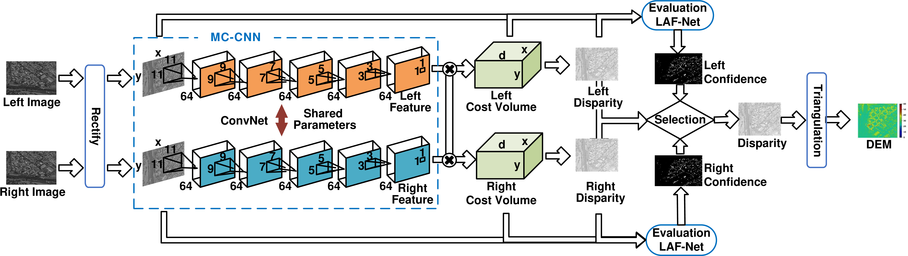

# The SATINET project
The SATINET project presents a deep learning based stereo-vision algorithm that was integrated within the Stereo Pipeline for Pushbroom Images (S2P) framework. The proposed stereo matching 
method applies a siamese convolutional neural network (CNN) to construct a cost volume. A median filter is applied to every slice in the cost volume to enforce spatial smoothness. We then 
apply another CNN to estimate the confidence map which is then used to derive the final disparity map. Simulation results on the IARPA dataset have shown that the proposed method achieves a 
gain of 4.5% in terms of completeness. A qualitative assessment reveals that the proposed method manages to generate DEMs with less noise. The proposed method adopts the architectured
depicted in the figure below.

*Diagram of the stereo matching method proposed by the SATINET project*

# Installation

Set up a virtual environment
```console
python3 -m venv satinet-venv
```
Initialize the virtual environment using

```console
source satinet-venv/bin/activate
```

Things to install

```console
pip install progressist
```

# TODO List
I need to fork to the s2p library from https://github.com/cmla/s2p.git - I need Johann's help on setting this up so that I can edit changes to the forked s2p repository.
I need to fork to the mccnn library from https://github.com/Jackie-Chou/MC-CNN-python.git - this needs to be extensively updated including the conversion from python2 to python3. Again I need Johann's help to setup the fork.
